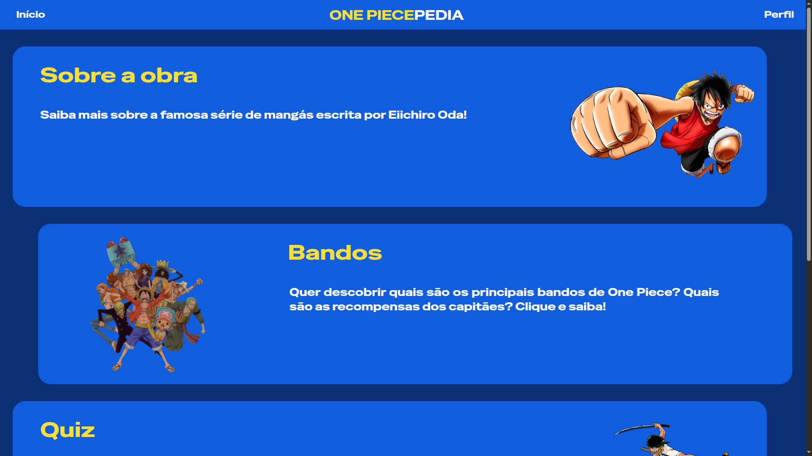
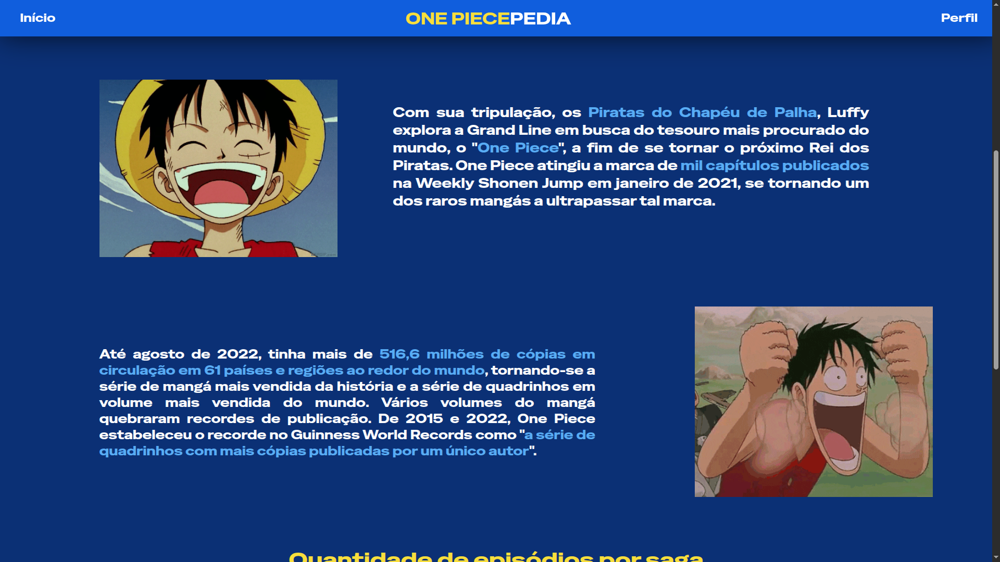

# ONE PIECEPEDIA

> One Piecepedia é o meu projeto individual do 1º semestre de Sistemas de Informação na São Paulo Tech School. Nele, eu busco trazer informações e um game a respeito do anime One Piece de Eiichiro Oda, aplicando neste projeto todos os conceitos aprendidos em sala de aula no semestre.

## 💻 Tecnologias utilizadas

## 📷 Imagens

